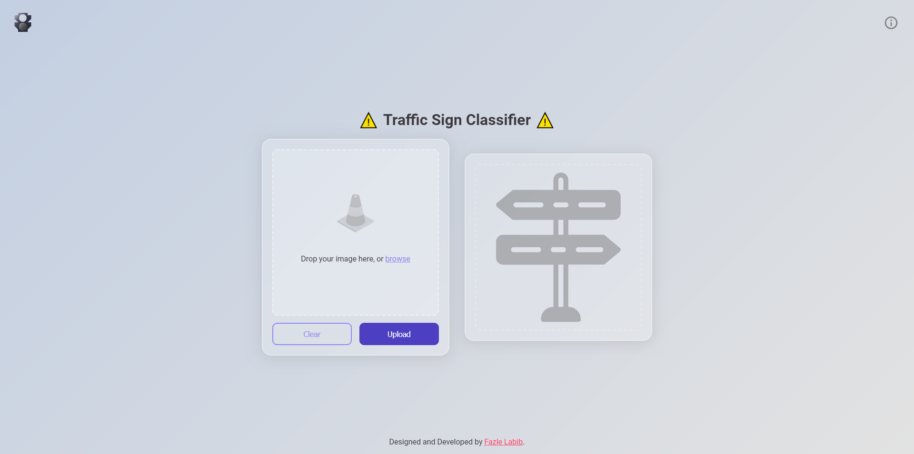

# ⚠️ **Traffic Sign Classifier** ⚠️

A web app for classifying traffic signs using a deep learning model trained on the ``German Traffic Sign Recognition Benchmark (GTSRB)`` dataset.



---

## 🚦 **Overview**

The **Traffic Sign Classifier** is a web-based application that allows users to classify traffic signs by uploading an image. It uses a Convolutional Neural Network (CNN) trained on the `GTSRB` dataset to identify and classify different types of traffic signs, providing the predicted label along with the confidence level.

---

## 💻 **Features**

- **Real-time Traffic Sign Classification**: Upload an image of a traffic sign, and the model instantly predicts its label and confidence score.
- **Drag & Drop Interface**: Users can drag and drop or select images directly from their device for classification.
- **Clear Button**: A simple option to reset the input and upload a new image.
- **Responsive Design**: Optimized for various screen sizes, from desktop to mobile.
- **Light/Dark Mode**: Seamless switch between light and dark modes to suit your preference.

---

## 🧠 **Model**

The classifier is built using a deep learning model, specifically a `Convolutional Neural Network (CNN)`, trained on the `GTSRB` dataset. The dataset consists of over 50,000 images across 43 different traffic sign categories.

- **Dataset**: [GTSRB Dataset](http://benchmark.ini.rub.de/?section=gtsrb&subsection=dataset)
- **Model Architecture**:
  - 3 Convolutional Layers
  - 2 Fully Connected Layers
  - Softmax for output classification
  
The model achieves `99.05%` accuracy in recognizing traffic signs from the test set.

---

## 📷 **How It Works**

1. **Upload an Image**: Click on the upload area or drag & drop an image of a traffic sign.
2. **Preview**: The app displays a preview of the uploaded image.
3. **Classify**: Once uploaded, the classifier will process the image and return the predicted traffic sign label along with a confidence score.
4. **Result Display**: The app presents the classified traffic sign with the associated confidence level and metadata.

---

## 🚀 **Getting Started**

### **Prerequisites**

Ensure you have the following installed:

- **Python==3.12.3+**
- **Django==5.1.1+**
- **torch==2.4.1+cu118**
- **pillow==10.2.0**

### **Installation**

1. **Clone the Repository**:

   ```bash
   git clone https://github.com/FazleLabib/TrafficSignClassifier.git
   cd TrafficSignClassifier
   ```

2. **Install Dependencies:**:

   ```bash
   pip install -r requirements.txt
   ```

3. **Run Migrations:**:

   ```bash
   python manage.py migrate
   ```

4. **Start the Django Development Server:**:

   ```bash
   python manage.py runserver
   ```

5. **Open the Application:**:

   Visit http://127.0.0.1:8000/ in your browser to access the Traffic Sign Classifier app.

---
